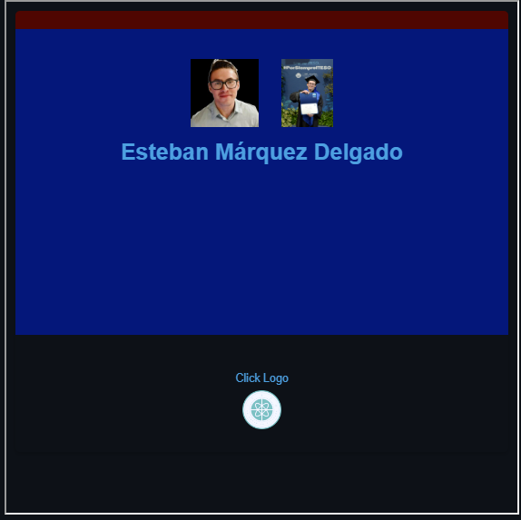
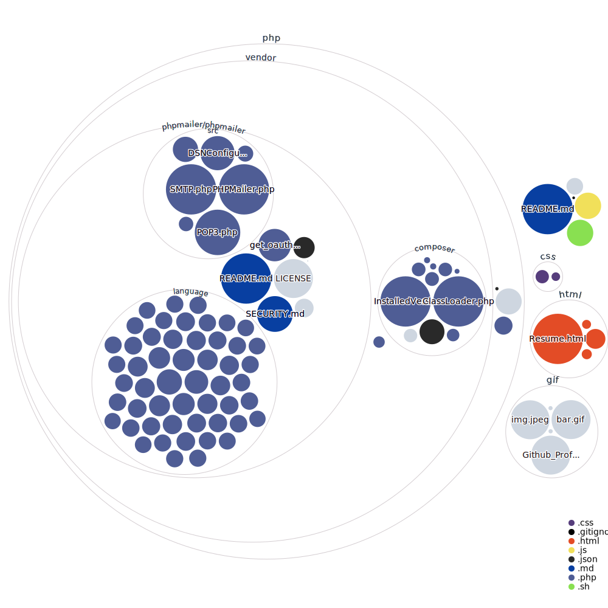
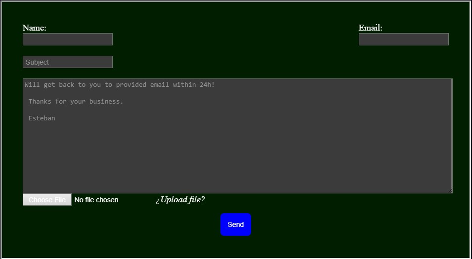

<head>
  <link rel="stylesheet" href="css/blue-bar.css">
  <link rel="stylesheet" href="https://cdn.jsdelivr.net/gh/kimeiga/bahunya/dist/bahunya.min.css">
</head>

<nav style="display: flex; justify-content: space-between;">
  

    <a href="#about">About</a>
    <a href="#tools">Tools</a>
    <a href="#inquiries">Inquiries</a>
  

<section id="inquiries">

 
 <i><b>Business Inquiries:</i></b> 
 

</section>
  
<a href="https://github.com/EstebanMqz/EstebanMqz/raw/main/download/Resume-Esteban_static.pdf">
  

    
  

<a href="https://github.com/EstebanMqz/EstebanMqz/raw/main/download/Resume-Esteban_static.docx">
  

    
  

<a href="https://estebanmqz.github.io/EstebanMqz/html/Resume.html">
  

    
  

</nav>

    

<h2> Esteban Márquez Delgado </h2>

  

 
  <b>
DS / DA 
BA & ML Engineer. </b> 

 

  

<section id="about">
  <h2>About:</h2>
  

 <h3><b><i>Education:</i></b></h3>

- <a href="https://egresados.blob.core.windows.net/anuarios/2022b-otono-iteso/index.html"><b>ITESO Financial Engineer BSc.</a>    </b>
<u>Data Science and Statistical Modelling</u> 
<i>(August 2018 - December 2022)</i> 
Guadalajara, Jalisco MX

<i>Distinctions:</i>
First place on college investment competition hosted by [MexDer](http://www.mexder.com.mx) financial derivatives operator [Kualiderivados](http://www.mexder.com.mx/wb3/wb/MEX/MEX_Repositorio/_vtp/MEX/202b_abrir_cuenta/_rid/21/_mto/3/Operadores.pdf) in 2018.

  Bsc. iframe  

  

 

- [Universidad Loyola](https://www.uloyola.es)  
<b>International Exchange Student, Economics</b> 
<i>August 2019 - December 2019</i> 
Seville, Spain

<i>Statistically modelling Behavioral Economics by the usage of recreative Social Media & key communications with International Exchange colleagues.</i>

- [Colegio Cervantes Costa Rica](https://cervantes.edu.mx)   
<b>Technical High School - Physics & Mathematics </b>  
<i>August 2014 - December 2017</i> 
Guadalajara, Jalisco MX

 <h3><b><i>Working Experience:</i></b></h3>

- [Trading Club GDL](https://tradingclubmx.com)  
<b>Portfolio Risk Management Associate </b> 
<i>January 2018 - Present (5 years 11 months) </i> 
Guadalajara, Jalisco MX   

<i>Historical Data Optimization Simulations for APIs automatic Portfolio Constructions, Risk Measuring & Predictive Modelling.</i> 

- [Investor House MX](https://www.investorhouse.com.mx)  
<b>Financial Analyst Associate </b> 
<i>May 2017 - Present (6 years 7 months) </i> 
Mexico City, MX  

<i>Web Scrapping Financial Data to perform Technical/Fundamental & Corporate Financial Data Analysis, insight delivery & support Investment Decisions.</i> 

- [SHCP](https://www.gob.mx/shcp)  
<b>Data Science Internship  </b> 
<i>May 2022 - December 2022 (8 months)  </i> 
Guadalajara, Jalisco MX   

<i>+1 million records automatic VCS CI/CD Cleansings ETL processes with NLP Supervised Classifications to develop Price Prediction Models on MX Clothings imports for taxing purposes.</i> 

- [Instituto de Información Estadística y Geográfica de Jalisco](https://iieg.gob.mx/ns/)  
<b>GIS Data Science Internship  </b> 
<i>January 2022 - May 2022 (5 months) </i>  
Guadalajara, Jalisco MX   

<i>HTTP querying Natural Protected Areas Remote Sensed Data with Satellite Imagery to identify zones of pressure with Unsupervised Learning algorithms.</i> 

 <h6><b><i>Algorithms Experience:</i></b></h6>

<i>

- Linear & Logistic Regressions
- Decision Trees
- Random Forests
- Support Vector Machines (SVMs)
- K-Nearest Neighbors (KNN)
- Naive Bayes
- Principal Component Analysis (PCA)
- K-Means & Hierarchical Clustering
- Gradient Boosting Machine (GBM)
- Genetic Algorithms
- Particle Swarm Optimization
- Adaline / Perceptron
- Artificial Neural Networks (Feed Forward, Recurrent, Convolutional, GANs, etc.)

</i>

</section>

<!-- 

  

 repository .gif subdirectory css > .gif display-->

<section id="tools">
  <h2>Tools:</h2>

<b> Programming Languages &#x1F5A5;</b>

|                                                     ~~Symbol~~                                                                                            |   Languages                                               | Experience |
| ----------------------------------------------------------------------------------------------------------------------------------------------------- | --------------------------------------------------------- | -----------|
|                                    | [Python](https://www.python.org/)                         | 5+ years   |
|                                              | [R](https://www.r-project.org/)                           | 4+ years   |
|                                    | [MATLAB](https://www.mathworks.com/products/matlab.html)  | 4+ years   |
|                                                                              | [Markdown](https://www.markdownguide.org/)                | 4+ years   |
|  | [LaTeX](https://www.latex-project.org/)                   | 4+ years   |
|                                          | [Git](https://git-scm.com/)                               | 4+ years   |
|                                      | [HTML](https://developer.mozilla.org/en-US/docs/Web/HTML) | 3+ years   |
|                                        | [CSS](https://developer.mozilla.org/en-US/docs/Web/CSS)   | 3+ years   |
|            | [YAML](https://yaml.org/)                                 | 1+ years   |
|                            | [JavaScript](https://developer.mozilla.org/en-US/docs/Web/JavaScript) | 1+ years   |
|                                    | [C#](https://docs.microsoft.com/en-us/dotnet/csharp/)     | -1 years   |
|                                          | [PHP](https://www.php.net/)                               | -1 years   |

<!-- 

  

 -->

<b>Frameworks &#x1F4F1;</b>

| Symbol                                                                                                                      | Framework                                  | Experience   |
| --------------------------------------------------------------------------------------------------------------------------- | ------------------------------------------ | ------------ |
|                                          | [Streamlit](https://streamlit.io)          | 2+ years     |
|                                  | [Keras](https://keras.io)                  | 1+ years      |
|        | [PyTorch](https://pytorch.org)             | 1+ years      |
|  | [TensorFlow](https://www.tensorflow.org)   | 1+ years      |
|          | [Node.js](https://nodejs.org/en)           | 1+ years      |
|            | [React.js](https://create-react-app.dev)   | 1+ years      |
|        | [.NET](https://dotnet.microsoft.com/)      | -1 years     |
|  | [Selenium](https://www.selenium.dev/)      | -1 years     |

<!-- 

  

 -->

<b>Hosting &#x1F310;</b>

| Symbol                                                                                                    | Service                                     | Experience          |
| ----------------------------------------------------------------------------------------------------------| ------------------------------------------- | ------------------- |
|             | [Github](https://github.com)                | 4+ years             |
|               | [Gitlab](https://about.gitlab.com)          | 2+ years            |
|           | [Azure](https://azure.microsoft.com/en-us/) | 1+ years             |

<!-- 

  

 -->

<b>Text Editor &#x1F4BB;</b>

| Symbol                                                                                                                                                             | Editor                                                                         | Experience          |
| -----------------------------------------------------------------------------------------------------------------------------------------------------------------  | ------------------------------------------------------------------------------ | ------------------- |
|                                     | [Jupyter](https://jupyter.org)                                                 | 4+ years            |
|                                                                                                        | [RStudio](https://posit.co/download/rstudio-desktop/)                          | 3+ years            |
|               | [Spyder](https://www.spyder-ide.org)                                           | 3+ years            |
|      | [VSCode](https://code.visualstudio.com)                                        | 2+ years            |
|                                                                                           | [VSCode Web](https://visualstudio.microsoft.com/services/visual-studio-online/)| 1+ years            |
|                                           | [GitHub Codespaces](https://github.com/features/codespaces)                    | 1+ years            |
|                                                                              | [Google Colab](https://colab.research.google.com/)                             | 1+ years            |
|                                     | [PyCharm](https://www.jetbrains.com/pycharm/)                                  | 2+ years            |

<!-- 

  

 -->

<b>CLIs &#x1F5A5; </b>

| Symbol                                                                                                                                                          | Editor     | Experience          |
| --------------------------------------------------------------------------------------------------------------------------------------------------------------- | ---------- | ------------------- |
|    | [Conda](https://docs.conda.io/en/latest/)      | 4+ year             |
|                        | [Bash](https://gitforwindows.org)       | 3+ years             |
|  | [CMD](https://learn.microsoft.com/en-us/windows-server/administration/windows-commands/cmd)        | 3+ years             |
|                             | [PowerShell](https://learn.microsoft.com/en-us/powershell/)       | 2+ years         |

<!-- 

  

 -->

 

<i>Frequent Libs: 

 

</i>

</section>

  

 
 <i> <i style="font-size: 11px;"> Repo Visualization: </i> 

 

 

  
<!--  if local unfetched -->

  <!-- <a href="https://mango-dune-07a8b7110.1.azurestaticapps.net/?repo=EstebanMqz%2FEstebanMqz">
     remote .html/GFM display-> -->

 

 

<!-- 
 <i>Official Web-Audit / Validation:</i>

 

 

 -->
  
<!-- 

  

 -->

</section>

