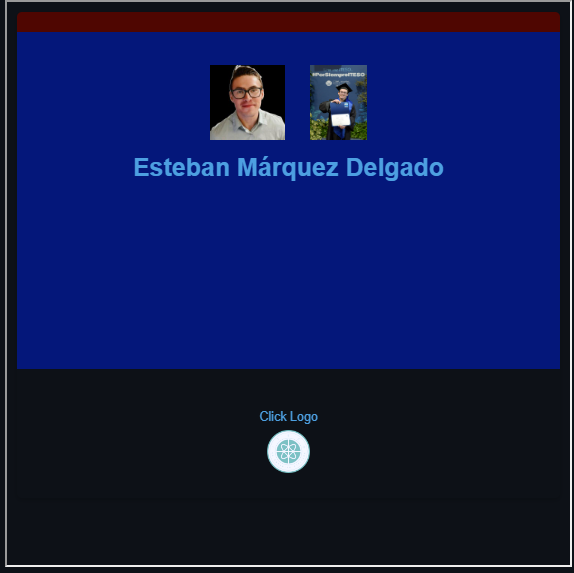

<head>
  <link rel="stylesheet" href="https://unpkg.com/water.css">
</head>

<nav style="display: flex; justify-content: right; align-items: center; background-color: rgba(0, 0, 0, 1); padding: 10px;">
  

    <a class="nav-link" href="#Education"><b>Education</b></a>
    <a class="nav-link" href="#Working-Experience"><b>Experience</b></a>
    <a class="nav-link" href="#Certifications"><b>Certifications</b></a>
    <a class="nav-link" href="#Tools"><b>Tools</b></a>
  

</nav>
<h1 style="font-size: 25px; font-weight: bold; text-shadow: 1px .5px darkred; color: black;"> RESUME </h1>

 
<h4> Esteban Márquez Delgado </h4>

:gear::bar_chart: <b> Financial Engineer BSc.</b> &Sigma; &Pi;
  

  
 <u>Jr. Data Scientist & QA Automation</u>  <i>(DA & BA | ML Eng. | DevOps) </i><b>  
</b>
  

 

 

    <b class="normal-text">Download Resume</b> 
    
      
    <b>Business Inquiries 24/7</b> 
    

<b> Contact:</b> 

<a href="https://mail.google.com/mail/?view=cm&fs=1&to=emarquez1895@gmail.com" target="Greetings Esteban I reviewed your work, skills and experience and I wish to schedule a Business Meeting with you." style="text-decoration: none;">

 &nbsp;
 &nbsp;
 &nbsp;

<section id="Education">

  

    <b>Education:</b>
  

  

      
  - [ITESO](https://www.iteso.mx/en/) 
    <b>[Financial Engineering BSc.](https://egresados.blob.core.windows.net/anuarios/2022b-otono-iteso/index.html)</b> 
    Statistical Modelling & Data Science 
    <i>August 2018 - December 2022 (5 years) 
    Guadalajara, MX</i>

    <u>Activities:</u>  
    Economics International Exchange [ERASMUS](https://www.erasmus.international) student & Investment societies. 

    <u>Distinctions:</u> 
    1° place on college investment competition hosted by [MexDer](http://www.mexder.com.mx) financial derivatives operator [Kualiderivados](http://www.mexder.com.mx/wb3/wb/MEX/MEX_Repositorio/_vtp/MEX/202b_abrir_cuenta/_rid/21/_mto/3/Operadores.pdf).</i>  
    
    

    
 

  -  [Universidad Loyola](https://www.uloyola.es) 
    <b>[International Erasmus Exchange](https://www.uloyola.es/servicios/oficina-internacional/politicas-programa-erasmus)</b> 
    Degree in Economics 
    <i>August 2019 - December 2019 (1 semester)</i> 
    <i>Seville, Spain</i> 
    <u>Activities:</u>  
    Statistically modelling [Behavioral Economics](https://www.uloyola.es/oferta-cientifica/personal-investigador/pablo-ernesto-branas-garza) theoretically & technically to simulate human behavior mainly using [MATLAB](https://www.mathworks.com/products/matlab.html) & [Python](https://www.python.org).  

  - [Colegio Cervantes Costa Rica](https://cervantes.edu.mx) 
    <b>Technical High School - Physics & Mathematics</b> 
    <i>August 2014 - December 2017 (3 years) 
    Guadalajara, MX</i>   

<section id="Working-Experience">

 
  

  

    <b>Working Experience:</b>
  

  - [Trading Club GDL](https://tradingclubmx.com) 
    Portfolio Risk Management Associate  
    <i>January 2018 - Present (6 years)  
    Guadalajara, MX </i>  
    <u>Activities:</u> 
    Historical Data Optimization Simulations for APIs automatic Portfolio Constructions, Risk Measuring & Predictive Modelling. 

  - [Investor House MX](https://www.investorhouse.com.mx) 
    Financial Analyst Associate  
    <i>May 2017 - Present (7 years)  
    Mexico City, MX </i>  
    <u>Activities:</u> 
    Web Scrapping Financial Data to perform Technical, Fundamental & Corporate Data Analysis to automate insight deliveries & support Investment Decisions.  

  - [SHCP](https://www.gob.mx/shcp) <i>(Secretaria de Hacienda y Crédito Público)</i> 
  Data Science Internship 
  <i>May 2022 - December 2022 (6 months) 
  Guadalajara, MX  </i>  
  <u>Activities:</u> 
  Big Data (+1m) automatic ETL processes with NLP Supervised Classifications to develop Price Prediction Models on MX Clothings imports for taxing purposes.  

  - [IIEG](https://iieg.gob.mx/ns/) (Instituto de Información Estadística y Geográfica de Jalisco) 
  GIS Data Science Internship  
  <i>January 2022 - May 2022 (6 months)   
  Guadalajara, MX  </i>  
  <u>Activities:</u> 
  HTTP querying Natural Protected Areas Remote Sensed Data with Satellite Imagery to identify zones of pressure with Unsupervised Learning algorithms.   

<section id="Certifications">

 
  

  

    <b>Certifications:</b>
  

+  

   5+ years experience using Github & [Github Copilot](https://github.com/features/copilot) (as a beta tester before its launch) while taking advantage of my .

  
  
Cloud backup & sharing purposes:

   & 

  Effectively [troubleshooting](https://github.com/EstebanMqz/Pkg_Migration) collaborations with DevOps.
    

+ <b></b> 
Studying English as a Second Language since I was 5 years old 3 hours a day I can effectively communicate with speakers verbally through native spelling & grammar.    

 

 

<section id="Tools">
  

  

    <b>Tools:</b>
  

 <h3 style="color: #ffffff;"> Programming Languages &#x1F5A5; </h3>
<table style="color: #000000;">
  <thead>
    <tr>
      <th>Symbol</th>
      <th>Language</th>
      <th>Experience</th>
    </tr>
  </thead>
  <tbody>
    <tr>
      <td></td>
      <td><a href="https://www.python.org/" style="color: #000000;">Python</a></td>
      <td>5+ years</td>
    </tr>
    <tr>
      <td></td>
      <td><a href="https://www.r-project.org/" style="color: #000000;">R</a></td>
      <td>4+ years</td>
    </tr>
    <tr>
      <td></td>
      <td><a href="https://www.mathworks.com/products/matlab.html" style="color: #000000;">MATLAB</a></td>
      <td>4+ years</td>
    </tr>
    <tr>
      <td></td>
      <td><a href="https://www.markdownguide.org/" style="color: #000000;">Markdown</a></td>
      <td>4+ years</td>
    </tr>
    <tr>
      <td></td>
      <td><a href="https://www.latex-project.org/" style="color: #000000;">LaTeX</a></td>
      <td>4+ years</td>
    </tr>
    <tr>
      <td></td>
      <td><a href="https://git-scm.com/" style="color: #000000;">Git</a></td>
      <td>4+ years</td>
    </tr>
    <tr>
      <td></td>
      <td><a href="https://developer.mozilla.org/en-US/docs/Web/HTML" style="color: #000000;">HTML</a></td>
      <td>3+ years</td>
    </tr>
    <tr>
      <td></td>
      <td><a href="https://developer.mozilla.org/en-US/docs/Web/CSS" style="color: #000000;">CSS</a></td>
      <td>3+ years</td>
    </tr>
    <tr>
      <td></td>
      <td><a href="https://yaml.org/" style="color: #000000;">YAML</a></td>
      <td>1+ years</td>
    </tr>
    <tr>
      <td></td>
      <td><a href="https://developer.mozilla.org/en-US/docs/Web/JavaScript" style="color: #000000;">JavaScript</a></td>
      <td>1+ years</td>
    </tr>
    <tr>
      <td></td>
      <td><a href="https://docs.microsoft.com/en-us/dotnet/csharp/" style="color: #000000;">C#</a></td>
      <td>-1 years</td>
    </tr>
    <tr>
      <td></td>
      <td><a href="https://www.php.net/" style="color: #000000;">PHP</a></td>
      <td>-1 years</td>
    </tr>
    <tr>
      <td></td>
      <td><a href="https://www.typescriptlang.org/" style="color: #000000;">TypeScript</a></td>
      <td>-1 years</td>
    </tr>
  </tbody>
</table>

 <h3 style="color: #ffffff;"> Frameworks &#x1F4F1;</h3>
<table style="color: #000000;">
  <thead>
    <tr>
      <th>Symbol</th>
      <th>Framework</th>
      <th>Experience</th>
    </tr>
  </thead>
  <tbody>
    <tr>
      <td></td>
      <td><a href="https://streamlit.io" style="color: #000000;">Streamlit</a></td>
      <td>2+ years</td>
    </tr>
    <tr>
      <td></td>
      <td><a href="https://keras.io" style="color: #000000;">Keras</a></td>
      <td>1+ years</td>
    </tr>
    <tr>
      <td></td>
      <td><a href="https://pytorch.org" style="color: #000000;">PyTorch</a></td>
      <td>1+ years</td>
    </tr>
    <tr>
      <td></td>
      <td><a href="https://www.tensorflow.org" style="color: #000000;">TensorFlow</a></td>
      <td>1+ years</td>
    </tr>
    <tr>
      <td></td>
      <td><a href="https://nodejs.org/en" style="color: #000000;">Node.js</a></td>
      <td>1+ years</td>
    </tr>
    <tr>
      <td></td>
      <td><a href="https://create-react-app.dev" style="color: #000000;">React.js</a></td>
      <td>1+ years</td>
    </tr>
    <tr>
      <td></td>
      <td><a href="https://dotnet.microsoft.com/" style="color: #000000;">.NET</a></td>
      <td>1+ years</td>
    </tr>
    <tr>
      <td></td>
      <td><a href="https://www.selenium.dev/" style="color: #000000;">Selenium</a></td>
      <td>1+ years</td>
    </tr>
  </tbody>
</table>

 <h3 style="color: #ffffff;"> Hosting &#x1F310;</h3>

<table style="color: #000000;">
  <thead>
    <tr>
      <th>Symbol</th>
      <th>Hosting</th>
      <th>Experience</th>
    </tr>
  </thead>
  <tbody>
    <tr>
      <td></td>
      <td><a href="https://github.com" style="color: #000000;">Github</a></td>
      <td>4+ years</td>
    </tr>
    <tr>
      <td></td>
      <td><a href="https://about.gitlab.com" style="color: #000000;">Gitlab</a></td>
      <td>2+ years</td>
    </tr>
    <tr>
      <td></td>
      <td><a href="https://azure.microsoft.com/en-us/" style="color: #000000;">Azure</a></td>
      <td>1+ years</td>
    </tr>
  </tbody>
</table>

 <h3 style="color: #ffffff;"> Text Editor &#x1F4BB;
</h3>

<table style="color: #000000;">
  <thead>
    <tr>
      <th>Symbol</th>
      <th>Editor</th>
      <th>Experience</th>
    </tr>
  </thead>
  <tbody>
    <tr>
      <td></td>
      <td><a href="https://jupyter.org" style="color: #000000;">Jupyter</a></td>
      <td>6+ years</td>
    </tr>
    <tr>
      <td></td>
      <td><a href="https://posit.co/download/rstudio-desktop/" style="color: #000000;">RStudio</a></td>
      <td>5+ years</td>
    </tr>
    <tr>
      <td></td>
      <td><a href="https://www.spyder-ide.org" style="color: #000000;">Spyder</a></td>
      <td>4+ years</td>
    </tr>
    <tr>
      <td></td>
      <td><a href="https://www.jetbrains.com/pycharm/" style="color: #000000;">PyCharm</a></td>
      <td>3+ years</td>
    </tr>
    <tr>
      <td></td>
      <td><a href="https://code.visualstudio.com" style="color: #000000;">VSCode</a></td>
      <td>3+ years</td>
    </tr>
    <tr>
      <td></td>
      <td><a href="https://visualstudio.microsoft.com/services/visual-studio-online/" style="color: #000000;">VSCode Web</a></td>
      <td>4+ years</td>
    </tr>
    <tr>
      <td></td>
      <td><a href="https://github.com/features/codespaces" style="color: #000000;">GitHub Codespaces</a></td>
      <td>3+ years</td>
    </tr>
    <tr>
      <td></td>
      <td></td>
      <td>2+ years</td>
    </tr>
  </tbody>
</table>

 <b><h3 style="color: #ffffff;"> Terminals &#x1F5A5; </h3></b>

<table style="color: #000000;">
  <thead>
    <tr>
      <th>Symbol</th>
      <th>Terminal</th>
      <th>Experience</th>
    </tr>
  </thead>
  <tbody>
    <tr>
      <td></td>
      <td><a href="https://docs.conda.io/en/latest/" style="color: #000000;">Conda</a></td>
      <td>5+ years</td>
    </tr>
    <tr>
      <td></td>
      <td><a href="https://gitforwindows.org" style="color: #000000;">Bash</a></td>
      <td>4+ years</td>
    </tr>
    <tr>
      <td></td>
      <td><a href="https://learn.microsoft.com/en-us/windows-server/administration/windows-commands/cmd" style="color: #000000;">CMD</a></td>
      <td>4+ years</td>
    </tr>
    <tr>
      <td></td>
      <td><a href="https://learn.microsoft.com/en-us/powershell/" style="color: #000000;">PowerShell</a></td>
      <td>3+ years</td>
    </tr>
    <tr>
      <td></td>
      <td><a href="https://ubuntu.com/" style="color: #000000;">Ubuntu</a></td>
      <td>3+ years</td>
    </tr>
  </tbody>
</table>

 <h3> DevTools &#x1F310;</h3>

<table style="color: #000000;">
  <thead>
    <tr>
      <th>Symbol</th>
      <th>DevTools</th>
      <th>Experience</th>
    </tr>
  </thead>
  <tbody>
    <tr>
      <td></td>
      <td><a href="https://developer.mozilla.org/en-US/docs/Web" style="color: #000000;">MDN Dev</a></td>
      <td>2+ years</td>
    </tr>
    <tr>
      <td></td>
      <td><a href="https://developer.chrome.com/docs/devtools/" style="color: #000000;">DevTools</a></td>
      <td>2+ years</td>
    </tr>
    <tr>
      <td></td>
      <td><a href="https://dev.opera.com/extensions/dev-tools/" style="color: #000000;">Experimental</a></td>
      <td>2+ years</td>
    </tr>
  </tbody>
</table>

   &nbsp;&nbsp;&nbsp;&nbsp;&nbsp;Algoritms Experience:

- [Linear & Logistic Regressions](https://en.wikipedia.org/wiki/Logistic_regression)
- [Decision Trees](https://en.wikipedia.org/wiki/Decision_tree)
- [Random Forests](https://en.wikipedia.org/wiki/Random_forest)
- [Support Vector Machines (SVMs)](https://en.wikipedia.org/wiki/Support-vector_machine)
- [K-Nearest Neighbors (KNN)](https://en.wikipedia.org/wiki/K-nearest_neighbors_algorithm)
- [Naive Bayes](https://en.wikipedia.org/wiki/Naive_Bayes_classifier)
- [Principal Component Analysis (PCA)](https://en.wikipedia.org/wiki/Principal_component_analysis)
- [K-Means](https://en.wikipedia.org/wiki/K-means_clustering)
- [Hierarchical Clustering](https://en.wikipedia.org/wiki/Hierarchical_clustering)
- [Gradient Boosting Machine (GBM)](https://en.wikipedia.org/wiki/Gradient_boosting)
- [Genetic Algorithms](https://en.wikipedia.org/wiki/Genetic_algorithm)
- [Particle Swarm Optimization](https://en.wikipedia.org/wiki/Particle_swarm_optimization)
- [Gradient Boosting Machine (GBM)](https://en.wikipedia.org/wiki/Gradient_boosting)
- [Genetic Algorithms (GA)](https://en.wikipedia.org/wiki/Genetic_algorithm)
- [Particle Swarm Optimization (PSO)](https://en.wikipedia.org/wiki/Particle_swarm_optimization)
- [Adaline](https://en.wikipedia.org/wiki/ADALINE)
- [Perceptron](https://en.wikipedia.org/wiki/Perceptron)
- [Feedforward Neural Network (FNN)](https://en.wikipedia.org/wiki/Feedforward_neural_network)
- [Recurrent Neural Network (RNN)](https://en.wikipedia.org/wiki/Recurrent_neural_network)
- [Convolutional Neural Network (CNN)](https://en.wikipedia.org/wiki/Convolutional_neural_network)
- [Long Short-Term Memory (LSTM)](https://en.wikipedia.org/wiki/Long_short-term_memory)
- [Generative Adversarial Networks (GANs)](https://en.wikipedia.org/wiki/Generative_adversarial_network)
- 

 

 
 <h3>Frequent Pkgs:</h3> 

Mostly experienced with the following libraries in remote environments:

 

 

 

