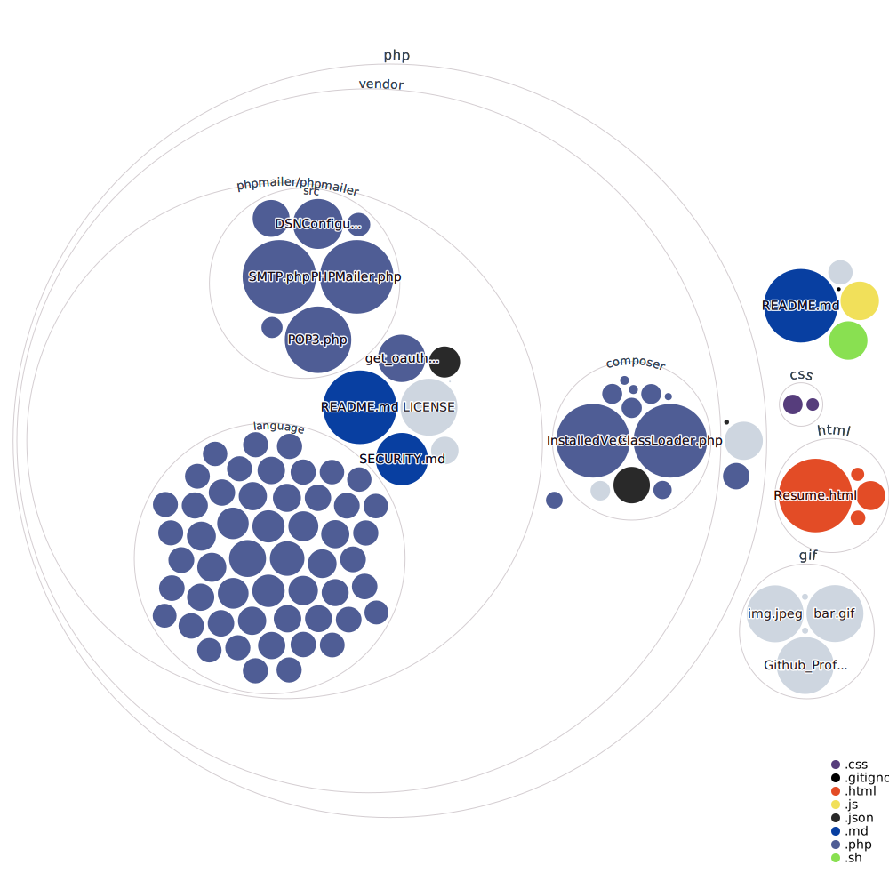
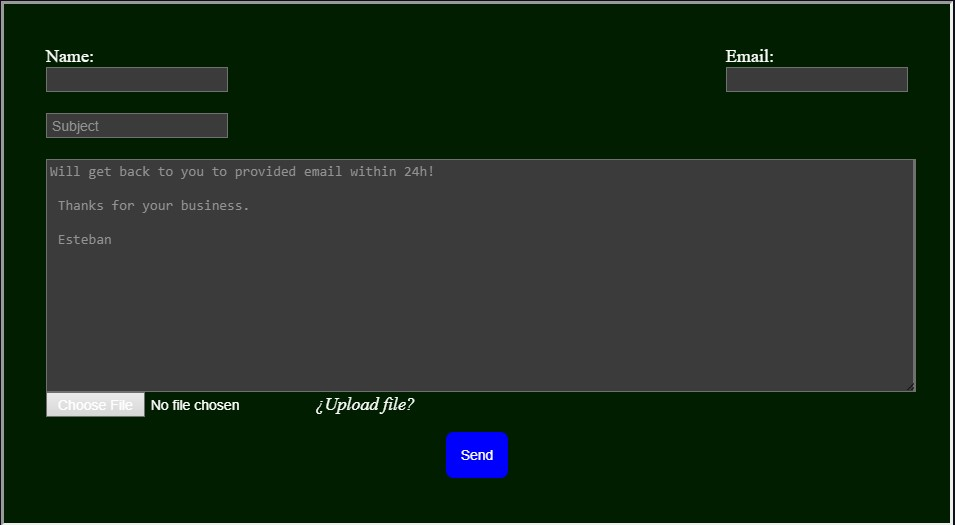

<head>
  <link rel="stylesheet" href="css/blue-bar.css">
  <link rel="stylesheet" href="https://cdn.jsdelivr.net/gh/kimeiga/bahunya/dist/bahunya.min.css">
</head>

<nav style="display: flex; justify-content: space-between;">
  

    <a href="#about">About</a>
    <a href="#tools">Tools</a>
    <a href="#inquiries">Inquiries</a>
  

   
  

  
    <a href="https://estebanmqz.github.io/EstebanMqz/html/Resume.html">Web</a>
  

</nav>

  

<h2> Greetings, I am Esteban Márquez D. </h3>

<a href="https://egresados.blob.core.windows.net/anuarios/2022b-otono-iteso/index.html"><b>Financial Engineer</b></a> passionate about Statistics and Machine Learning :bar_chart::gear:   

<b>About:</b>

<section id="about">

##### <b><i>Education:</i></b> 

:robot: :speech_balloon: Esteban lived most of his childhood in Mexico where he studied English $3_h$ a day for $10_{years}$ & obtained the <b>TOEFL</b> at 14</i>. 
Eventually, he graduated from [Cervantes Costa Rica](https://cervantes.edu.mx) <b><i>Math & Physics</b></i> high school. 

He was soon enrolled in college for Engineering and during his Bachelor studies he was elected to be an international Financial Engineering student in Seville, [Loyola University](https://www.uloyola.es) where he took some of the main courses of its Degree in Economics including <i>Game Theory & International Economics</i>. This inspired him to simulate human behavior to prove Game Theory assumptions using digital interviews from exchange students in Spain.  
In Dec. 2022 he acquired his <i>$9_{th}$ semester<b> Bachelor's degree in Financial Engineering</b></i> from [ITESO](https://www.topuniversities.com/universities/iteso-universidad-jesuita-de-guadalajara). 

He is currently enrolled in courses to help him certificate as an [`Azure Data Scientist Associate`](https://learn.microsoft.com/en-us/certifications/azure-data-scientist/) & [`Tableau Desktop Specialist`](https://www.tableau.com/learn/certification/desktop-specialist).
##### <b><i>Work:</i></b>
Esteban has worked since 2017 as an independent investment advisor for members of [TradingClubGdl](https://tradingclubmx.com) and [InvestorHouseMX](https://www.investorhouse.com.mx) among other investment groups and enthusiasts. Consequently, he was the $1_{st}$ place on a <i>competition</i> hosted by the [MexDer](http://www.mexder.com.mx/wb3/wb/MEX) financial derivatives operator [Kualiderivados](http://www.mexder.com.mx/wb3/wb/MEX/MEX_Repositorio/_vtp/MEX/202b_abrir_cuenta/_rid/21/_mto/3/Operadores.pdf) in 2018. 

In 2022 he was part of the Geospatial Analysis engineering team in his college and implemented <i>Supervised Learning</i> algorithms for the [IIEG](https://iieg.gob.mx/ns/) to sense remotely the zones of pressure contained in the polygons of [Natural Protected Areas](https://semadet.jalisco.gob.mx/medio-ambiente/biodiversidad/areas-naturales-protegidas) using [LandSat](https://landsat.gsfc.nasa.gov) and [Google Earth Engine](https://code.earthengine.google.com) satellite imagery geospatial data.  

Moreover, his thesis involved feature engineering big data CI/CD pipelines with nature language processing <a href="https://www.gob.mx/sat/acciones-y-programas/comercio-exterior"> over Customs and Foreign Trades</a> on clothes imports for predictive modelling.    
Currently, he is working on a project that fetches markets data in real time including most <i>major Stock Market Indexes</i> and their respective <b>components</b>, in order to <b>predict</b> most <b><i>known</i> portfolio optimizations</b> using <b>Recurrent Neural Networks</b> and <i><b>web development UX/UI designs</i></b> for clients according to their investment <i>objectives / regions</i>.  

 <i>  Algorithm Experience: 

  
He has at least implemented the following known algorithms for tasks & projects:
- Linear & Logistic Regressions
- Decision Trees
- Random Forests
- Support Vector Machines (SVMs)
- K-Nearest Neighbors (KNN)
- Naive Bayes
- Principal Component Analysis (PCA)
- K-Means & Hierarchical Clustering
- Gradient Boosting Machine (GBM)
- Genetic Algorithms
- Particle Swarm Optimization
- Adaline / Perceptron
- Artificial Neural Networks (Feed Forward, Recurrent, Convolutional, GANs, etc.)

  

<h1>Tools</h1>
<section id="tools">

<b> Programming Languages &#x1F5A5;</b>

|                                                     ~~Symbol~~                                                                                            |   Languages                                               | Experience |
| ----------------------------------------------------------------------------------------------------------------------------------------------------- | --------------------------------------------------------- | -----------|
|                                    | [Python](https://www.python.org/)                         | 5+ years   |
|                                              | [R](https://www.r-project.org/)                           | 4+ years   |
|                                    | [MATLAB](https://www.mathworks.com/products/matlab.html)  | 4+ years   |
|                                                                              | [Markdown](https://www.markdownguide.org/)                | 4+ years   |
|  | [LaTeX](https://www.latex-project.org/)                   | 4+ years   |
|                                          | [Git](https://git-scm.com/)                               | 4+ years   |
|                                      | [HTML](https://developer.mozilla.org/en-US/docs/Web/HTML) | 3+ years   |
|                                        | [CSS](https://developer.mozilla.org/en-US/docs/Web/CSS)   | 3+ years   |
|            | [YAML](https://yaml.org/)                                 | 1+ years   |
|                            | [JavaScript](https://developer.mozilla.org/en-US/docs/Web/JavaScript) | 1+ years   |
|                                    | [C#](https://docs.microsoft.com/en-us/dotnet/csharp/)     | -1 years   |
|                                          | [PHP](https://www.php.net/)                               | -1 years   |

  

<b>Frameworks &#x1F4F1;</b>

| Symbol                                                                                                                      | Framework                                  | Experience   |
| --------------------------------------------------------------------------------------------------------------------------- | ------------------------------------------ | ------------ |
|                                          | [Streamlit](https://streamlit.io)          | 2+ years     |
|                                  | [Keras](https://keras.io)                  | 1+ year      |
|        | [PyTorch](https://pytorch.org)             | 1+ year      |
|  | [TensorFlow](https://www.tensorflow.org)   | 1+ year      |
|          | [Node.js](https://nodejs.org/en)           | 1+ year      |
|            | [React.js](https://create-react-app.dev)   | 1+ year      |
|        | [.NET](https://dotnet.microsoft.com/)      | -1 years     |

  

<b>Hosting &#x1F310;</b>

| Symbol                                                                                                    | Service                                     | Experience          |
| ----------------------------------------------------------------------------------------------------------| ------------------------------------------- | ------------------- |
|             | [Github](https://github.com)                | 4+ year             |
|               | [Gitlab](https://about.gitlab.com)          | 2+ years            |
|           | [Azure](https://azure.microsoft.com/en-us/) | 1+ year             |

  

<b>Text Editor &#x1F4BB;</b>

| Symbol                                                                                                                                                             | Editor                                                                         | Experience          |
| -----------------------------------------------------------------------------------------------------------------------------------------------------------------  | ------------------------------------------------------------------------------ | ------------------- |
|                                     | [Jupyter](https://jupyter.org)                                                 | 4+ years            |
|                                                                                                        | [RStudio](https://posit.co/download/rstudio-desktop/)                          | 3+ years            |
|               | [Spyder](https://www.spyder-ide.org)                                           | 3+ years            |
|      | [VSCode](https://code.visualstudio.com)                                        | 2+ years            |
|                                                                                           | [VSCode Web](https://visualstudio.microsoft.com/services/visual-studio-online/)| 1+ years            |
|                                           | [GitHub Codespaces](https://github.com/features/codespaces)                    | 1+ years            |
|                                                                              | [Google Colab](https://colab.research.google.com/)                             | 1+ years            |
|                                     | [PyCharm](https://www.jetbrains.com/pycharm/)                                  | 2+ years            |

  

<b>Terminals &#x1F4BB;</b>

| Symbol                                                                                                                                                          | Editor     | Experience          |
| --------------------------------------------------------------------------------------------------------------------------------------------------------------- | ---------- | ------------------- |
|    | [Conda](https://docs.conda.io/en/latest/)      | 4+ year             |
|                        | [Bash](https://gitforwindows.org)       | 3+ year             |
|                                                                                    | [CMD](https://learn.microsoft.com/en-us/windows-server/administration/windows-commands/cmd)        | 2+ year             |
|                                                                                                     | [Shell](https://learn.microsoft.com/en-us/powershell/scripting/install/installing-powershell-on-windows?view=powershell-7.3)      | 2+ year             |

  

<i>Frequent Pkgs:</i>

 

<i>

</i>

  

 
 <i> <i style="font-size: 11px;"> Repo Visualization: </i> 

 

 

   

  
<!--  if local unfetched -->

  <a href="https://mango-dune-07a8b7110.1.azurestaticapps.net/?repo=EstebanMqz%2FEstebanMqz">
     <!-- remote .html/GFM display-> -->

 

  

  <a href="https://validator.w3.org/nu/?doc=https%3A%2F%2Festebanmqz.github.io%2FEstebanMqz%2Fhtml%2FResume.html">

<h2><b>Business Inquiries:</b></h2>
<section id="inquiries">

 

</section>

  

